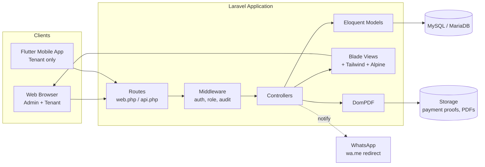
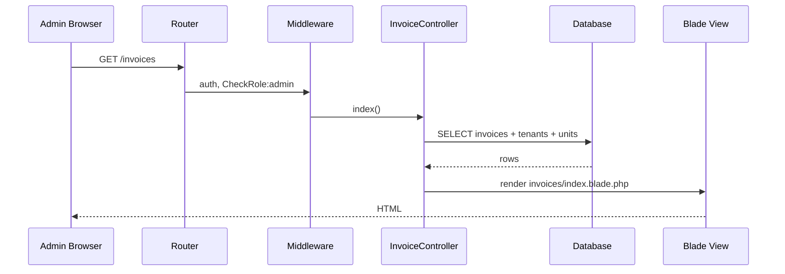
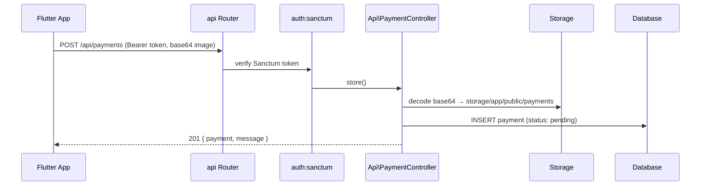

# 01 — System Overview

## 1. Purpose

Braga8 Utility Billing is a web + mobile application that automates monthly utility
(electricity, water) billing for the **Gedung Braga 8** commercial building. Building
operators record meter readings, the system calculates consumption against configurable
tariffs, generates invoices (PDF), notifies tenants via WhatsApp, and tracks payment
verification. Tenants can view their invoices, submit payment proof, and raise complaints
through either the web UI or a mobile API consumed by a Flutter client.

## 2. High-Level Architecture

The system is a monolithic Laravel 12 application serving two front-ends:

1. **Web UI** — server-rendered Blade + TailwindCSS + Alpine.js, consumed by admins and

   tenants in a desktop browser.

2. **Mobile API** — JSON over HTTPS (Sanctum token auth), consumed by a Flutter tenant

   app via `axios`.



## 3. Technology Stack

| Layer | Technology | Notes |
| ------- | ----------- | ------- |
| Language | PHP 8.2 | Strict types used in newer modules. |
| Framework | Laravel 12 | Monolith, single deployable. |
| Auth (web) | Laravel Breeze | Session + CSRF, blade auth scaffolding. |
| Auth (api) | Laravel Sanctum | Token-based, `braga8_auth_token` ability. |
| DB | MySQL / MariaDB | Relational, single schema `braga8_utility_billing`. |
| Frontend | TailwindCSS + Alpine.js + Vite | Server-rendered Blade, minimal JS. |
| PDF | `barryvdh/laravel-dompdf` | Invoice PDF generation. |
| HTTP client (mobile) | axios | Used by Flutter via JS bridge / HTTP package. |
| Notifications | WhatsApp `wa.me` deep links | No third-party WA API; admin clicks link, WA opens pre-filled. |
| Tests | PestPHP | Feature + unit tests. |
| Static analysis | Semgrep (custom ruleset) | `.semgrep/braga8-custom.yml`. |

## 4. Logical Layers

```text
┌─────────────────────────────────────────────────────┐
│ Presentation                                        │
│  • Blade views (resources/views/*)                  │
│  • JSON responses (Api/* controllers)               │
├─────────────────────────────────────────────────────┤
│ HTTP / Routing                                       │
│  • routes/web.php, routes/api.php                   │
│  • Middleware: auth, CheckRole, AuditLog            │
├─────────────────────────────────────────────────────┤
│ Application (Controllers)                            │
│  • InvoiceController, PaymentController,            │
│    DashboardController, TenantController, etc.      │
│  • Business logic lives in controllers (no Service  │
│    layer directory exists).                          │
├─────────────────────────────────────────────────────┤
│ Domain (Eloquent Models)                             │
│  • User, Tenant, Unit, UtilityMeter, MeterReading,  │
│    Tariff, Invoice, InvoiceItem, Payment,           │
│    Complaint, UsageReport                            │
├─────────────────────────────────────────────────────┤
│ Persistence                                           │
│  • MySQL via Eloquent ORM                            │
│  • File storage: storage/app/public/payments, PDFs  │
└─────────────────────────────────────────────────────┘
```

> **Note on layering:** The codebase intentionally keeps business logic inside
> controllers rather than extracting a service layer. This keeps the monolith
> approachable for a small team but couples HTTP concerns to domain logic.
> Future refactors may extract `app/Services/` if complexity grows.

## 5. Request Flow

### 5.1 Web request (admin views invoice list)



### 5.2 Mobile API request (tenant submits payment)



## 6. Component Inventory

| Component | Location | Responsibility |
| ----------- | ---------- | ---------------- |
| Web routes | `routes/web.php` | Admin + tenant web endpoints. |
| API routes | `routes/api.php` | Mobile-only endpoints (auth, payments, invoices, complaints). |
| Controllers | `app/Http/Controllers/` | 9 web controllers + `Api/` namespace. |
| Middleware | `app/Http/Middleware/` | `CheckRole`, `AuditLog`. |
| Models | `app/Models/` | 10 Eloquent models. |
| Migrations | `database/migrations/` | 18 migrations building the schema. |
| Blade views | `resources/views/` | Layouts, dashboard, invoices, payments, tenants, units, complaints. |
| Console commands | `app/Console/Commands/` | `SendReminder` (scheduled). |
| Config | `config/` | Standard Laravel + dompdf. |

## 7. Cross-Cutting Concerns

- **Authentication** — dual mechanism: sessions (web) and Sanctum tokens (API). See

  [04-security-architecture.md](04-security-architecture.md).

- **Authorization** — role-based (`admin`, `tenant`) enforced by `CheckRole` middleware

  on web routes and inline role checks in API controllers.

- **Audit logging** — `AuditLog` middleware records admin actions to the `audit_logs`

  table for traceability.

- **Localization** — UI strings are Bahasa Indonesia, hardcoded in Blade. No i18n layer.
- **Error handling** — Laravel default exception handler; no custom reporter. API errors

  return JSON `{ message, error }`.

- **Notifications** — WhatsApp deep links (`wa.me/<phone>?text=...`) opened in the

  admin's browser; no server-side WA API integration.
