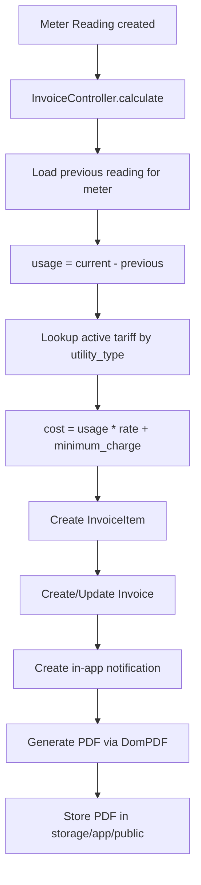
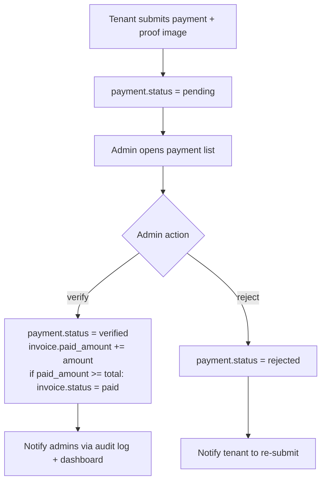

# 02 — Data Architecture

## 1. Database Engine

- **Engine:** MySQL / MariaDB (InnoDB).
- **Schema:** single database `braga8_utility_billing`.
- **Charset:** `utf8mb4` (default Laravel 12).
- **ORM:** Eloquent. No raw SQL is used in application code.

## 2. Entity Relationship Diagram

```mermaid
erDiagram
    users ||--o| tenants : "1:1 (tenant profile)"
    tenants ||--o{ units : "owns/leases"
    units ||--o{ utility_meters : "has meters"
    utility_meters ||--o{ meter_readings : "readings over time"
    utility_meters }o--|| tariffs : "priced by tariff"
    units ||--o{ invoices : "billed per period"
    invoices ||--|{ invoice_items : "line items"
    invoices ||--o{ payments : "paid against"
    tenants ||--o{ complaints : "raises"
    users ||--o{ audit_logs : "performs (admin)"

    users {
        bigint id PK
        string name
        string email UK
        string password
        enum role "admin|tenant"
        timestamp email_verified_at
        timestamps
    }
    tenants {
        bigint id PK
        bigint user_id FK
        string full_name
        string phone
        string id_number
        timestamps
    }
    units {
        bigint id PK
        bigint tenant_id FK
        string unit_number UK
        string floor
        string type
        decimal area
        timestamps
    }
    utility_meters {
        bigint id PK
        bigint unit_id FK
        enum utility_type "electric|water"
        string meter_number UK
        timestamps
    }
    tariffs {
        bigint id PK
        enum utility_type "electric|water"
        decimal rate_per_unit
        decimal minimum_charge
        date effective_date
        string name
        timestamps
    }
    meter_readings {
        bigint id PK
        bigint utility_meter_id FK
        bigint previous_reading_id FK
        decimal current_reading
        decimal previous_reading
        decimal usage
        date reading_date
        string period
        bigint recorded_by FK
        timestamps
    }
    invoices {
        bigint id PK
        string invoice_number UK
        bigint unit_id FK
        bigint tenant_id FK
        date billing_period
        decimal total_amount
        decimal paid_amount
        enum status "unpaid|partial|paid"
        date due_date
        timestamps
    }
    invoice_items {
        bigint id PK
        bigint invoice_id FK
        enum item_type "electric|water|other"
        string description
        decimal quantity
        decimal unit_price
        decimal subtotal
        timestamps
    }
    payments {
        bigint id PK
        bigint invoice_id FK
        bigint tenant_id FK
        decimal amount
        date payment_date
        string method
        string proof_image
        enum status "pending|verified|rejected"
        bigint verified_by FK
        timestamps
    }
    complaints {
        bigint id PK
        bigint tenant_id FK
        string subject
        text description
        enum status "open|in_progress|resolved|closed"
        text admin_response
        timestamps
    }
    audit_logs {
        bigint id PK
        bigint user_id FK
        string action
        string module
        text details
        string ip_address
        timestamps
    }
```

## 3. Schema Details

### 3.1 Core tables

| Table | Purpose | Key constraints |
| ------- | --------- | ----------------- |
| `users` | Auth principals. | `email` unique. `role` enum. |
| `tenants` | Tenant profile, 1:1 with `users` where `role=tenant`. | `user_id` FK → users. |
| `units` | Physical rental units in the building. | `unit_number` unique. `tenant_id` nullable (vacant). |
| `utility_meters` | Electric / water meters attached to a unit. | `meter_number` unique. `utility_type` enum. |
| `tariffs` | Configurable rates per utility type. | `(utility_type, effective_date)` effective rate lookup. |
| `meter_readings` | Periodic readings; `usage = current - previous`. | Self-FK `previous_reading_id` for chaining. |
| `invoices` | Monthly billing document per unit. | `invoice_number` unique. Status enum drives workflow. |
| `invoice_items` | Line items (electric, water, other charges). | FK → invoices (cascade delete). |
| `payments` | Tenant payment submissions with proof image. | `status` enum drives verification workflow. |
| `complaints` | Tenant complaints / maintenance requests. | Status enum + `admin_response`. |
| `audit_logs` | Append-only admin action log. | Written by `AuditLog` middleware. |

### 3.2 Migration history

Migrations live in `database/migrations/`. Notable migrations:

| Migration | Change |
| ----------- | -------- |
| `0001_01_01_000000_create_users_table.php` | Base auth tables (users, password_reset_tokens, sessions). |
| `0001_01_01_000001_create_cache_table.php` | Cache + jobs tables. |
| `*_create_tenants_table.php` | Tenants. |
| `*_create_units_table.php` | Units. |
| `*_create_utility_meters_table.php` | Utility meters. |
| `*_create_tariffs_table.php` | Tariffs. |
| `*_create_meter_readings_table.php` | Meter readings. |
| `*_create_invoices_table.php` | Invoices. |
| `*_create_invoice_items_table.php` | Invoice items. |
| `*_create_payments_table.php` | Payments. |
| `*_create_complaints_table.php` | Complaints. |
| `*_create_audit_logs_table.php` | Audit logs. |
| `*_create_notifications_table.php` | In-app notifications. |
| `2026_03_31_162328_add_name_to_tariffs_table.php` | Adds `name` column to tariffs for human-readable labels. |

## 4. Data Flow: Invoice Calculation



## 5. Data Flow: Payment Verification



## 6. File Storage

| Path | Contents | Visibility |
| ------ | ---------- | ----------- |
| `storage/app/public/payments/` | Uploaded payment proof images. | Public via `storage:link` symlink. |
| `storage/app/public/invoices/` | Generated invoice PDFs (when stored). | Public via symlink. |
| `storage/app/private/` | Any private attachments. | Not web-accessible. |

The `php artisan storage:link` command must be run on deployment so
`public/storage` → `storage/app/public`.

## 7. Backups

- No automated backup is configured in the application layer.
- Operational backup is the responsibility of the deployment environment

  (see [06-deployment-architecture.md](06-deployment-architecture.md)).

- Recommended: daily mysqldump + binary log replication for PITR.
