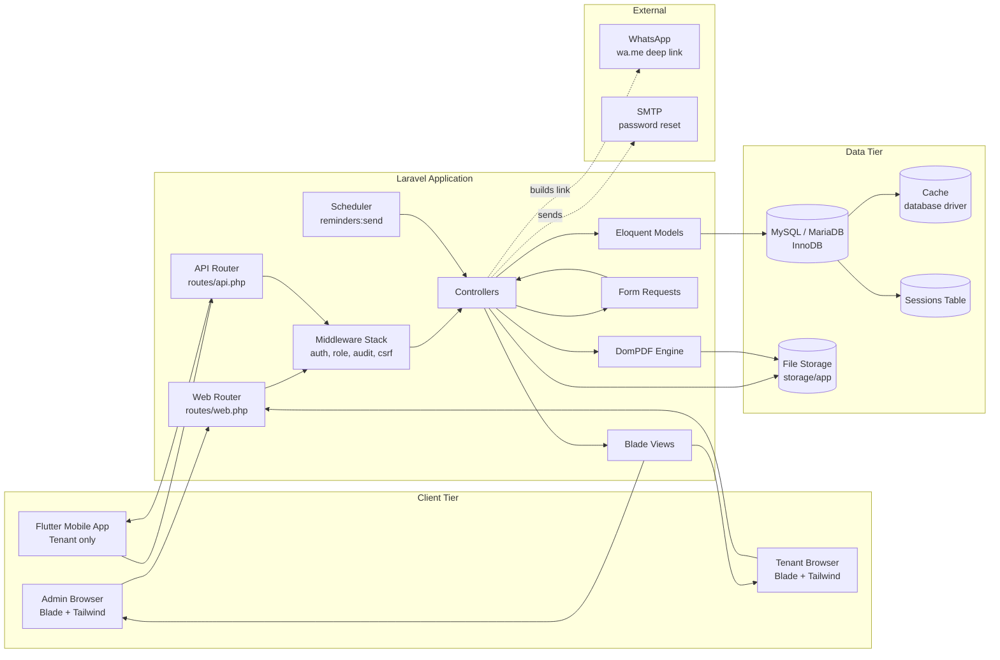
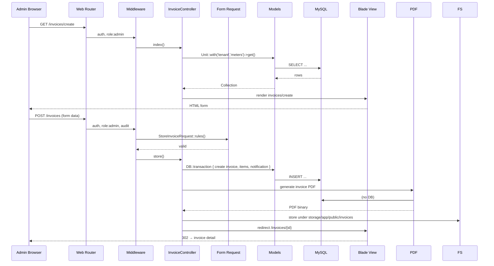
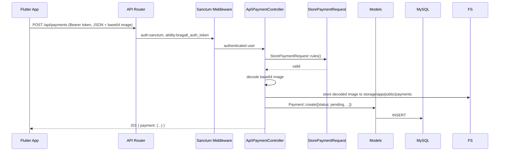
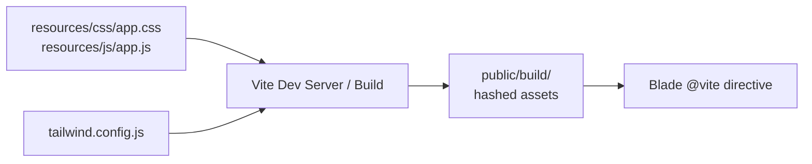

# 05 — Component Diagram

## 1. High-Level Component View

## 2. Component Responsibilities

| Component | Responsibility | Technology |
| ----------- | --------------- | ------------ |
| Admin Browser | Full CRUD UI, dashboard, reports. | HTML + TailwindCSS + Alpine.js + Chart.js. |
| Tenant Browser | Limited self-service portal. | Same Blade stack, restricted views. |
| Flutter App | Mobile tenant experience: invoices, payments, complaints. | HTTP + bearer token to `/api/*`. |
| Web Router | Maps browser URLs to controllers. | Laravel routing. |
| API Router | Maps `/api/*` to API controllers. | Laravel + Sanctum. |
| Middleware | Auth, role check, audit log, CSRF. | Laravel middleware pipeline. |
| Controllers | Orchestrate request → model → view/response. | PHP 8.2. |
| Form Requests | Validate + authorize input. | Laravel FormRequest. |
| Eloquent Models | Data access + relationships. | Laravel Eloquent ORM. |
| Blade Views | Server-rendered HTML. | Laravel Blade + Tailwind. |
| DomPDF | Generate invoice PDFs. | barryvdh/laravel-dompdf. |
| Scheduler | Daily reminder job. | Laravel Scheduler + cron. |
| MySQL | Persistent storage. | InnoDB engine. |
| File Storage | Payment proofs + generated PDFs. | Local disk + `storage:link`. |

## 3. Request Flow — Web (Admin)

## 4. Request Flow — API (Mobile Payment)

## 5. Build & Asset Pipeline

- **Dev:** `npm run dev` starts Vite HMR server.
- **Prod:** `npm run build` compiles + hashes assets into `public/build/`.
- Blade's `@vite(['resources/css/app.css','resources/js/app.js'])` resolves to

  hashed filenames in production.
