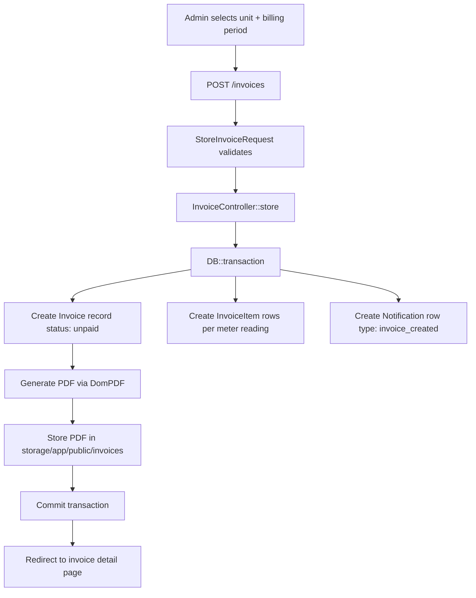
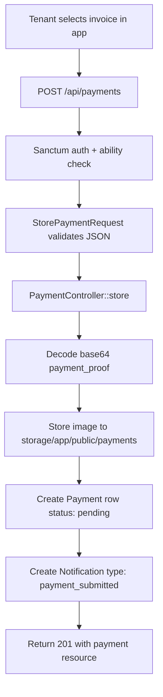
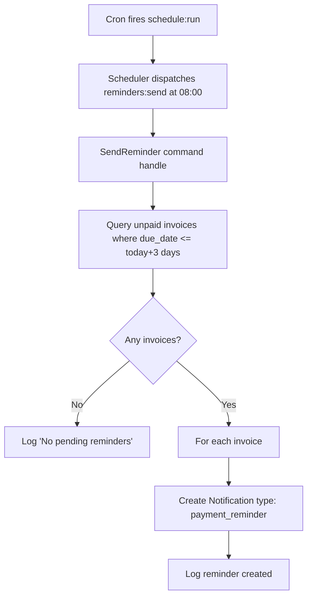
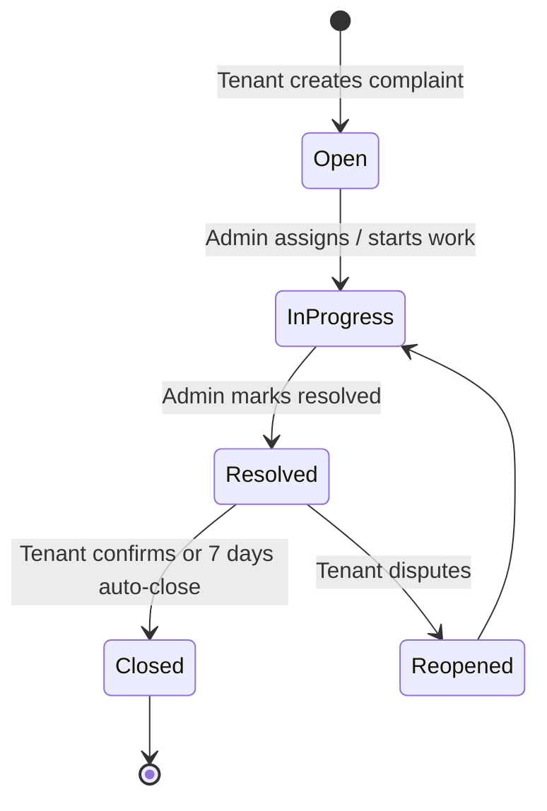
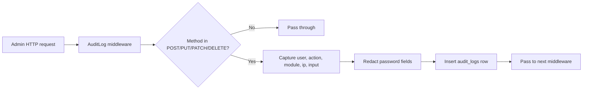
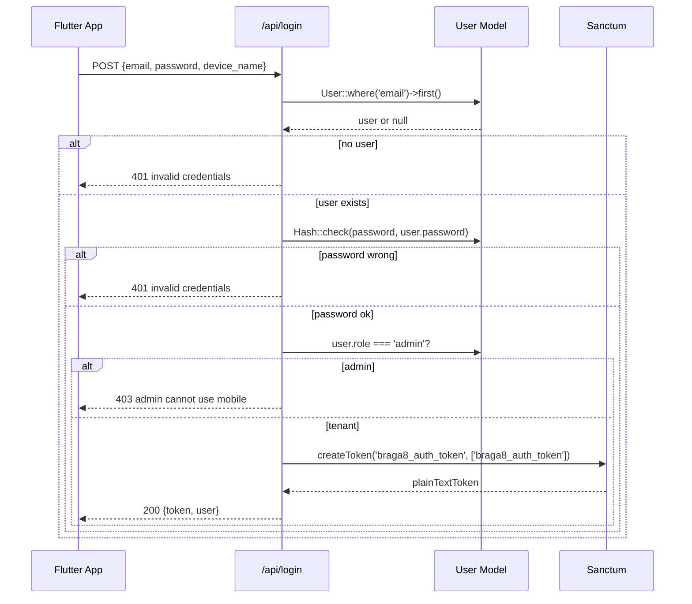

# 07 — Data Flow

This document traces the end-to-end data flow for the system's primary use cases.

## 1. Invoice Generation (Admin)



**Inputs:** unit_id, billing period (month/year), per-meter previous + current
readings, tariff_id (auto-selected from unit's meters).

**Outputs:** `invoices` row, `invoice_items` rows, `notifications` row, PDF file on
disk, `audit_logs` row (via middleware).

**Side effects:** none beyond DB + filesystem. No outbound email/SMS at this stage.

## 2. Payment Upload (Tenant, Mobile)



**Inputs:** invoice_id, amount, payment_date, payment_method, payment_proof (base64
image string).

**Outputs:** `payments` row (status: pending), `notifications` row, image file on
disk.

**Admin follow-up:** admin opens web UI → Payments → verifies the uploaded proof →
clicks "Verify" → `PaymentController@verify` flips status to `verified` and marks
the linked invoice `paid`.

## 3. Daily Reminder Job



**Inputs:** none (reads DB state).

**Outputs:** `notifications` rows, log entries.

**Note:** the command does **not** send WhatsApp/SMS itself. It creates
notification records that admins can action via the web UI (which builds a
`wa.me` deep link).

## 4. Complaint Lifecycle



**Data writes:**

- Tenant creates → `complaints` row (status: open) + `notifications` row.
- Admin updates status → `complaints.status` updated + `audit_logs` row.
- Tenant reopens → `complaints.status` reverted.

## 5. Audit Log Capture



**Captured on:** every mutating admin request.
**Not captured on:** GET requests, API requests, tenant web requests.

## 6. Authentication (API)



## 7. PDF Generation

```mermaid
flowchart LR
    A[Controller calls PDF::loadView] --> B[DomPDF renders Blade template]
    B --> C[Template reads invoice + items + tenant + unit]
    C --> D[HTML → PDF conversion]
    D --> E[Save to storage/app/public/invoices/{id}.pdf]
    E --> F[Return path / stream to browser]
```

**Templates:** `resources/views/invoices/pdf.blade.php` (and any variant per
document type).

**Performance note:** PDF generation is synchronous. For high-volume billing
runs, this should be moved to a queued job (see Deployment Architecture §10).
